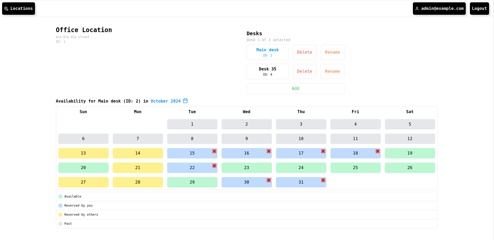
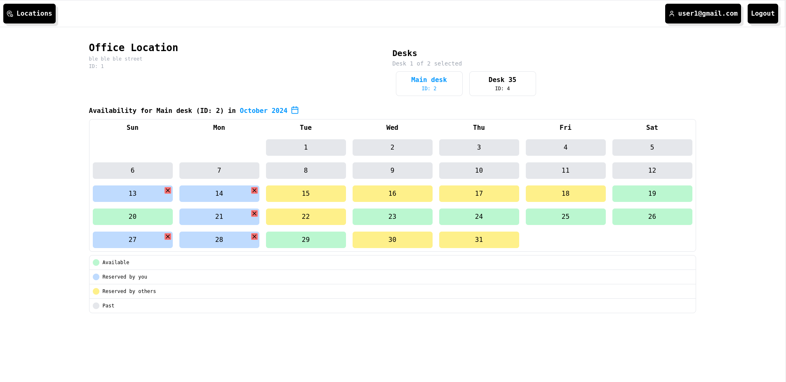
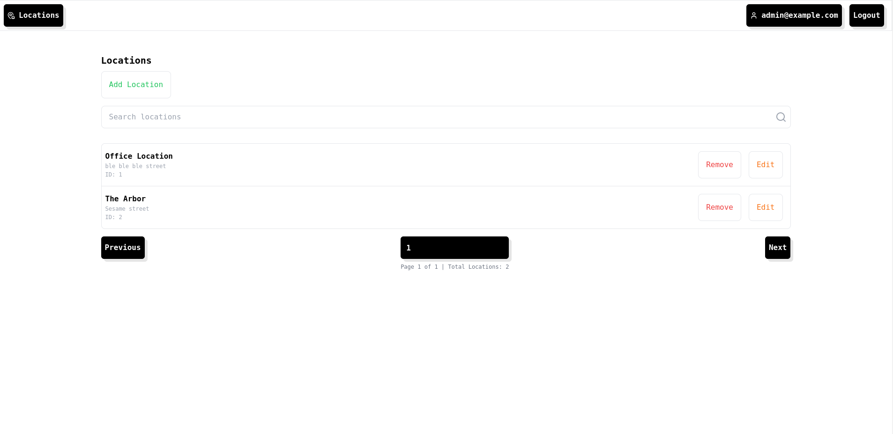
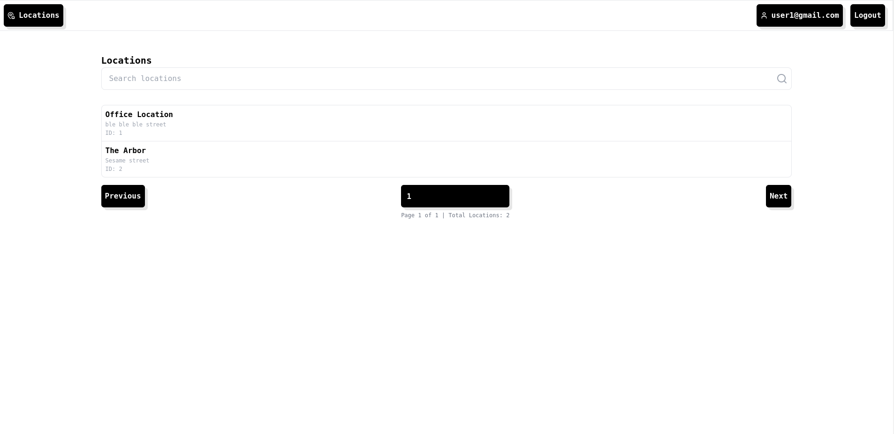
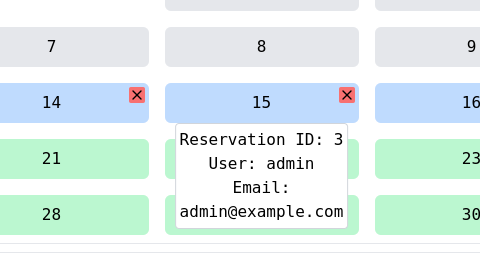

# Hot desk booking system

> Author: Karol Koś

## 1. Introduction
Application is composed of three main components:

- A React frontend application
- An ASP.NET Core backend application
- A PostgreSQL database

All components are containerized and run within Docker.

## 2. How to Run

### Building and Running the Project
To build and run the project using Docker, execute the following command:

```
docker compose -f docker-compose-example.yml -p hdbs_example up -d --build
```

To access it use **http://localhost:5173/**

This command will build the necessary Docker images and start the containers in detached mode.

### Stopping and Removing the Project
To stop and remove all containers, networks, and volumes associated with this project, use:

```
docker compose -f docker-compose-example.yml -p hdbs_example down -v
```

## 3. Admin Credentials
Use the following credentials to access the admin panel:

- **Email:** `admin@example.com`
- **Password:** `12345678`

Other users (non administrative users) need to be added manually via register option.

## 4. Views
**Important view and usage differs if we log in as user or as administrator**

### Location (admin view)

### Location (user view)

### Locations (admin view)

### Locations (user view)

### Reservation info
When hovering over a day in the calendar in the admin view, show information about the reservation owner. In the user view, no information will be displayed.


## 5. Additional informations
- Unfortunately, there are no unit tests implemented.
- The "Forgot Password" option is currently just a placeholder.
- Project could be done much better in many aspects; for example password could be hashed to protect user privacy but unfortunately i didn't have much time to do that